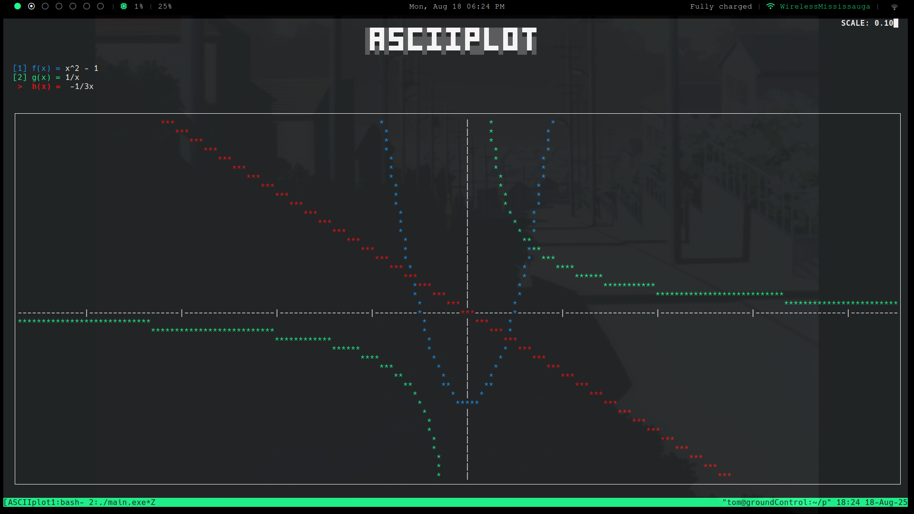
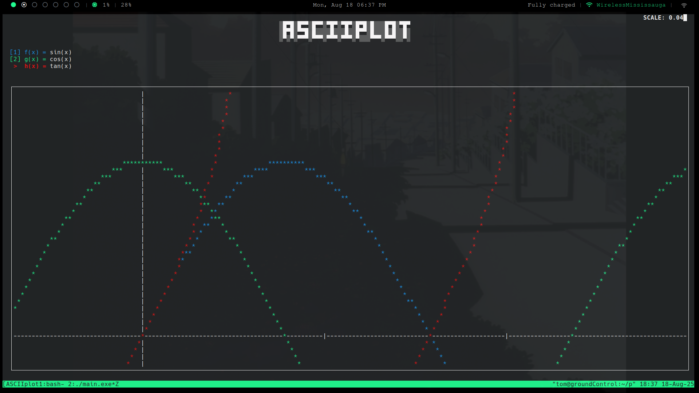

░█▀█░█▀▀░█▀▀░▀█▀░▀█▀░█▀█░█░░░█▀█░▀█▀
░█▀█░▀▀█░█░░░░█░░░█░░█▀▀░█░░░█░█░░█░
░▀░▀░▀▀▀░▀▀▀░▀▀▀░▀▀▀░▀░░░▀▀▀░▀▀▀░░▀░

Graphing calculator for your terminal!

Built with C and ncurses. 

## Usage
You need the ncurses library and Make installed.
- Clone this repository
- `cd` into the repo
- run `make`
- run `./main.exe` to start the application

## Controls
- `<M-[1,2,3]>` select function input (1, 2, 3). 
- `<M-n>` or `<M-j>` next function input. 
- `<M-N>` or `<M-k>` prev function input.
- Enter key on selected function to graph it. 
- Arrow keys to move around graph. 
- pg up and pg down to zoom in and out of the plane. 

## Gallery

